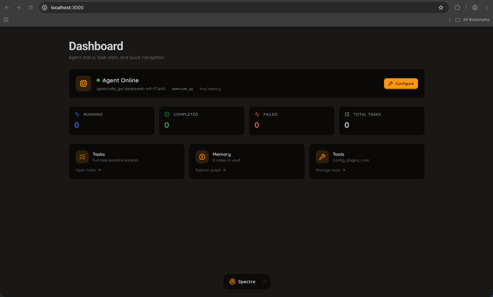
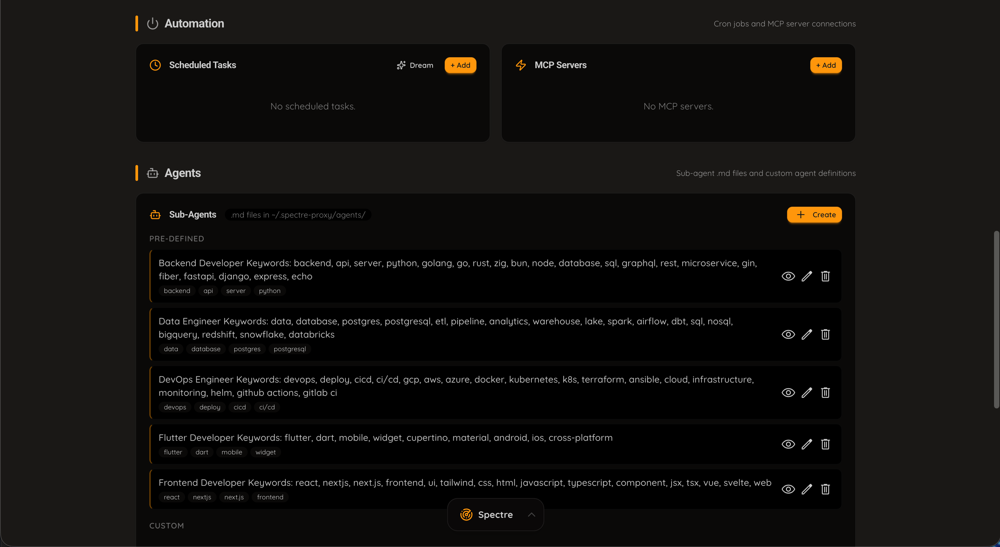

<div align="center">

<p>
  
</p>

<h1 style="border-bottom: none; margin-bottom: 20px;">Spectre Proxy</h1>

**Use Claude Code, Codex, or Gemini with any provider — not just their own. OpenRouter, Gemini, OpenCode, Groq, Ollama, and more.**

[](https://opensource.org/licenses/MIT)
[](https://go.dev/)
[](https://nextjs.org/)
[](https://www.docker.com/)
[](https://www.typescriptlang.org/)

A high-performance, Go-powered AI proxy that sits between your AI coding agent and **17+ AI providers**. Use the same proxy with **Claude Code, OpenAI Codex, or Google Gemini** — and route any model through any provider.

[Quick Start](#quick-start) · [CLI Usage](#cli-usage) · [Providers](#supported-providers) · [Architecture](#provider-architecture) · [Dashboard](#dashboard) · [IDEs](#ide-integrations) · [Contributing](#contributing)

</div>

<div align="center">
  
</div>

> ⚠️ **Experimental** — Spectre Proxy is in active development. **Claude Code** is verified working. **Codex** and **Gemini** support is newly implemented and needs community testing. All provider backends (OpenRouter, DeepSeek, Ollama, etc.) are implemented but many are untested. Jump in!

---

## Features

| Feature | Status | Description |
|---------|--------|-------------|
| **Multi-CLI support** | ✅ | Switch between Claude Code, OpenAI Codex, and Google Gemini — one proxy, any CLI |
| **Multi-provider AI gateway** | ✅ | 17 provider backends — route all three CLIs through any provider |
| **Anthropic Messages API** | ✅ | `/v1/messages` — for Claude Code and any Anthropic-compatible client |
| **OpenAI Responses API** | ✅ | `/v1/responses` — for Codex CLI and any Responses-compatible client |
| **Google GenAI API** | ✅ | `/v1beta/models/{model}:*` — for Gemini CLI and any GenAI-compatible client |
| **Model listing** | ✅ | All three formats available: `/v1/models`, `/v1/responses/models`, `/v1beta/models` |
| **Interactive CLI picker** | ✅ | Run `spectre` to select your agent — or use `--cli` flag / `CLI_BACKEND` env var |
| **Per-model routing** | ✅ | Route Claude Sonnet / Opus / Haiku tiers independently |
| **Streaming responses** | ✅ | Full SSE streaming with tool use, thinking blocks across all protocols |
| **Request optimizations** | ✅ | Network probe mocking, title generation skip, suggestion mode skip |
| **Dashboard** | ✅ | Live status, task stats, recent activity, model/provider info |
| **Web search & fetch** | ✅ | Built-in `web_search` (DuckDuckGo) and `web_fetch` tools |
| **Cron / scheduled tasks** | ✅ | Recurring prompts on intervals |
| **Sub-agent system** | ✅ | Define agent personalities as `.md` files with keyword-based routing |
| **MCP server manager** | ✅ | Add and manage MCP servers from the dashboard |
| **Discord bot** | ⏳ | Run AI sessions via Discord |
| **Telegram bot** | ⏳ | Run AI sessions via Telegram |
| **Plugin marketplace** | ⏳ | Curated plugins and skills |
| **VS Code extension** | ⏳ | Sidebar chat + dashboard |
| **Zed extension** | ✅ | Zed tasks, MCP configuration |
| **Docker deployment** | ✅ | `docker compose up` for proxy + dashboard |

---

## Aim & Scope

Spectre Proxy aims to be **the universal proxy layer** for AI coding agents — regardless of which CLI protocol they use. The core philosophy: **one endpoint, any provider, any model, any CLI.**

| Client | Protocol | Status |
|--------|----------|--------|
| **Claude Code CLI** (`claude`) | Anthropic Messages API (`/v1/messages`) | ✅ Fully supported |
| **OpenAI Codex CLI** (`codex`) | OpenAI Responses API (`/v1/responses`) | ✅ New — needs testing |
| **Google Gemini CLI** (`gemini`) | Google GenAI API (`/v1beta/...`) | ✅ New — needs testing |
| **Any Anthropic-compatible client** | `/v1/messages` | ✅ Supported |
| **Any OpenAI Responses client** | `/v1/responses` | ✅ Supported |
| **Any GenAI-compatible client** | `/v1beta/...` | ✅ Supported |
| **VS Code (Claude Code ext.)** | Anthropic | ⏳ In progress |
| **Zed** | MCP + Anthropic | ✅ Supported |
| **Cursor** | — | ❌ Not implemented |

---

## Screenshots

<div align="center">
  <table>
    <tr>
      <td align="center"><strong>Dashboard</strong></td>
      <td align="center"><strong>Tasks / Kanban</strong></td>
    </tr>
    <tr>
      <td></td>
      <td></td>
    </tr>
    <tr>
      <td align="center"><strong>Memory Vault</strong></td>
      <td align="center"><strong>Model Selection</strong></td>
    </tr>
    <tr>
      <td></td>
      <td></td>
    </tr>
    <tr>
      <td align="center"><strong>Settings / Configuration</strong></td>
      <td align="center"><strong>Floating Bottom Bar</strong></td>
    </tr>
    <tr>
      <td></td>
      <td></td>
    </tr>
  </table>
</div>

---

## Prerequisites & Dependencies

### Required

| Dependency | Version | Notes |
|-----------|---------|-------|
| **Docker Desktop** (recommended) | Latest | Simplest setup — both proxy + dashboard in containers |
| **Or Go** | 1.26+ | For running the proxy directly |
| **Or Node.js / npm** | 24+ / 10+ | For running the dashboard directly |
| **API key** | — | At least one from a [supported provider](#supported-providers) |

### Optional — AI Coding Agent CLIs

Pick at least one CLI to use with the proxy:

| CLI | Install | Notes |
|-----|---------|-------|
| **Claude Code** | `npm install -g @anthropic-ai/claude-code` | Most tested backend |
| **OpenAI Codex** | `npm install -g @openai/codex` | New — proxy integration in preview |
| **Google Gemini** | `npm install -g @google/gemini-cli` | New — proxy integration in preview |

### Per-Provider API Keys

Each provider needs its own API key. Set them in `~/.spectre-proxy/.env`:

```env
# Pick at least one:
OPENROUTER_API_KEY=sk-or-v1-...
ANTHROPIC_API_KEY=sk-ant-...
OPENAI_API_KEY=sk-...
GEMINI_API_KEY=...
DEEPSEEK_API_KEY=sk-...
GROQ_API_KEY=gsk_...
MISTRAL_API_KEY=...
# ... see full list in Supported Providers below
```

---

## Quick Start

### 1. Clone & Run (Docker — Recommended)

```bash
git clone https://github.com/chrisbeckett/spectre-proxy.git
cd spectre-proxy
./setup.sh
```

Or jump straight in:

```bash
# Set at least one API key
export OPENROUTER_API_KEY=sk-or-v1-...

# Start everything
bash docker/run.sh up
```

Once running:

- **Dashboard**: [http://localhost:3000](http://localhost:3000)
- **Proxy API**: [http://localhost:8082](http://localhost:8082)
- **Health check**: `curl http://localhost:8082/health`

### 2. Launch Your Agent

```bash
# Interactive — pick your CLI at launch time
spectre

# Launch a specific CLI directly
spectre --cli claude                    # Claude Code
spectre --cli codex                     # OpenAI Codex
spectre --cli gemini                    # Google Gemini

# Quick prompt (uses the CLI from CLI_BACKEND env or defaults to proxy API)
spectre "write a python script"

# Persist your preference
echo 'CLI_BACKEND=codex' >> ~/.spectre-proxy/.env
```

---

## CLI Usage

The `spectre` CLI tool is your entry point:

```bash
spectre                           # Select backend interactively, then launch
spectre --cli claude              # Launch Claude Code directly
spectre --cli codex               # Launch OpenAI Codex directly
spectre --cli gemini              # Launch Google Gemini directly
spectre "your prompt"             # Quick single prompt
spectre status                    # Check proxy health
spectre models                    # List available models
spectre-dashboard                 # Open dashboard in browser
spectre-start                     # Start proxy + dashboard
spectre-stop                      # Stop all services
```

### Backend Selection Order

1. `--cli` flag wins if provided
2. `CLI_BACKEND` env var in `~/.spectre-proxy/.env`
3. Interactive prompt (shows Claude Code, Codex, Gemini)
4. Defaults to Claude Code

---

## Supported Providers

Spectre Proxy supports **17 provider backends** across two API transport types. All providers work with all three CLI protocols — the proxy translates automatically.

### Anthropic Messages API (Native)

| Provider | Config Key | Status | Docs |
|----------|-----------|--------|------|
| **OpenRouter** | `OPENROUTER_API_KEY` | ✅ Working | [openrouter.ai](https://openrouter.ai) |
| **DeepSeek** | `DEEPSEEK_API_KEY` | ⏳ Untested | [platform.deepseek.com](https://platform.deepseek.com) |
| **Wafer** | `WAFER_API_KEY` | ⏳ Untested | [wafer.ai](https://wafer.ai) |
| **Kimi** | `KIMI_API_KEY` | ⏳ Untested | [platform.moonshot.ai](https://platform.moonshot.ai) |
| **Fireworks AI** | `FIREWORKS_API_KEY` | ⏳ Untested | [fireworks.ai](https://fireworks.ai) |
| **Z.ai** | `ZAI_API_KEY` | ⏳ Untested | [z.ai](https://z.ai) |
| **Ollama** (local) | — | ⏳ Untested | [ollama.com](https://ollama.com) |
| **LM Studio** (local) | — | ⏳ Untested | [lmstudio.ai](https://lmstudio.ai) |
| **llama.cpp** (local) | — | ⏳ Untested | [github.com/ggml-org/llama.cpp](https://github.com/ggml-org/llama.cpp) |

### OpenAI Chat Completions (Translated)

| Provider | Config Key | Status | Docs |
|----------|-----------|--------|------|
| **NVIDIA NIM** | `NVIDIA_NIM_API_KEY` | ⏳ Untested | [build.nvidia.com](https://build.nvidia.com) |
| **Gemini (Google AI Studio)** | `GEMINI_API_KEY` | ⏳ Untested | [aistudio.google.com](https://aistudio.google.com) |
| **Mistral** | `MISTRAL_API_KEY` | ⏳ Untested | [console.mistral.ai](https://console.mistral.ai) |
| **Codestral** | `CODESTRAL_API_KEY` | ⏳ Untested | [console.mistral.ai](https://console.mistral.ai) |
| **OpenCode Zen** | `OPENCODE_API_KEY` | ⏳ Untested | [opencode.ai](https://opencode.ai) |
| **OpenCode Go** | `OPENCODE_API_KEY` | ⚠️ Issues | [opencode.ai](https://opencode.ai) |
| **Cerebras** | `CEREBRAS_API_KEY` | ⏳ Untested | [cloud.cerebras.ai](https://cloud.cerebras.ai) |
| **Groq** | `GROQ_API_KEY` | ⏳ Untested | [console.groq.com](https://console.groq.com) |

---

## Provider Architecture

Each AI provider is implemented as an **independent Go package** under `agent/internal/providers/<name>/`. Every provider explicitly declares which CLI protocols it supports by implementing `StreamAnthropic`, `StreamResponses`, and/or `StreamGenAI`.

### Package Layout

```
agent/internal/providers/
├── provider.go              # Provider interface: StreamAnthropic, StreamResponses, StreamGenAI
├── factory.go               # ProviderFactories map + RegisterProvider()
├── protoutil/               # Shared protocol translation utilities
│   ├── responses.go         #   Responses API ↔ MessagesRequest
│   └── genai.go             #   GenAI API ↔ MessagesRequest
├── anthropic/               # Base Anthropic Messages API transport
│   └── transport.go         #   StreamAnthropic + StreamResponses + StreamGenAI
├── openai/                  # Base OpenAI Chat Completions transport
│   ├── transport.go         #   StreamAnthropic + StreamResponses + StreamGenAI
│   ├── convert.go           #   Anthropic→OpenAI request conversion
│   └── sse.go               #   OpenAI→Anthropic SSE translation
├── openrouter/              # Individual provider packages
│   ├── provider.go          #   ─ wraps anthropic.Transport, delegates all 3 protocols
│   └── register.go          #   ─ self-registers via init()
├── gemini/
│   ├── provider.go          #   ─ wraps openai.Transport
│   └── register.go
├── ollama/
├── deepseek/
└── ... (16 provider packages total)
```

### How Protocol Translation Works

Each provider package wraps either the `anthropic.Transport` or `openai.Transport`. Both transports implement all three CLI protocols:

```
Provider.StreamAnthropic()  → transport handles native format → upstream API
Provider.StreamResponses()  → transport parses Responses req → translates → upstream API
                             → transport translates response back to Responses SSE
Provider.StreamGenAI()      → transport parses GenAI req → translates → upstream API
                             → transport translates response back to GenAI SSE
```

### Protocol Support per Provider

Every provider explicitly declares its support:

```go
func (p *Provider) ProtocolSupport() providers.ProtocolSupport {
    return providers.ProtocolSupport{
        Anthropic: true,  // Works with Claude Code CLI
        Responses: true,  // Works with OpenAI Codex CLI
        GenAI:     true,  // Works with Google Gemini CLI
    }
}
```

All 16 providers support all three protocols by default (via transport delegation). A provider that only supports a subset simply omits the unsupported methods.

### Adding a New Provider

1. Create a new package under `agent/internal/providers/<name>/`
2. Write `provider.go` — implement the `Provider` interface wrapping `anthropic.Transport` or `openai.Transport`
3. Override `ProtocolSupport()` to declare which CLI protocols you support
4. Write `register.go` — call `providers.RegisterProvider("name", New)` in `init()`
5. Add to `config/providers.go` for the admin UI catalog

Your provider automatically gets all three CLI protocols if it delegates to a transport. Override `StreamResponses` or `StreamGenAI` for custom handling.

---

## API Endpoints

| Endpoint | Method | Protocol | Used By |
|----------|--------|----------|---------|
| `/health` | GET | — | Health checks |
| `/` | GET | — | Root status |
| `/v1/models` | GET | Anthropic/OpenAI | Dashboard, `spectre models` |
| `/v1/responses/models` | GET | OpenAI | Codex CLI |
| `/v1beta/models` | GET | Google GenAI | Gemini CLI |
| `/v1/messages` | POST | Anthropic Messages | Claude Code |
| `/v1/messages/count_tokens` | POST | Anthropic | Token estimation |
| `/v1/responses` | POST | OpenAI Responses | Codex CLI |
| `/v1beta/models/{model}:generateContent` | POST | Google GenAI | Gemini CLI (non-streaming) |
| `/v1beta/models/{model}:streamGenerateContent` | POST | Google GenAI | Gemini CLI (streaming) |
| `/v1/providers` | GET | — | Provider metadata |
| `/admin/api/*` | GET/POST | — | Dashboard configuration |

---

## Dashboard

The Spectre Proxy dashboard is a full-featured Next.js command center:

- **Live agent status** — Online/offline, model, provider, latency
- **Task statistics** — Running, completed, failed tasks at a glance
- **Kanban board** — Drag-and-drop task management
- **Memory vault** — Notes, knowledge graph, 3D graph visualization
- **Configuration** — API keys, model routing, proxy settings, CLI backend selection
- **Cron jobs** — Schedule recurring AI prompts
- **MCP servers** — Add and manage MCP connections
- **Sub-agents** — Define agent personalities as `.md` files
- **Activity feed** — Real-time log with type filtering

---

## IDE Integrations

### VS Code Extension

Install from `ide/vscode/`:

```bash
cd ide/vscode && npm install && npm run build
# Cmd+Shift+P → Developer: Install Extension from Location...
```

### Zed Extension

```bash
cp -r ide/zed/.zed /path/to/your/project/
```

Includes tasks for: Open Dashboard, Chat, Start/Stop proxy, Build, Test Health, and more.

---

## Project Structure

```text
spectre-proxy/
├── agent/                   # Go proxy server
│   ├── cmd/
│   │   ├── spectre/         #   CLI tool (agent launcher with backend picker)
│   │   └── spectre-server/  #   Proxy daemon
│   └── internal/
│       ├── config/          # Settings & provider catalog
│       ├── messaging/       # Discord & Telegram bots
│       ├── protocol/        # Anthropic/OpenAI/GenAI protocol types
│       ├── providers/       # 16 provider backends + 2 transports
│       │   ├── protoutil/   #   Protocol translation utilities
│       │   ├── anthropic/   #   Anthropic Messages API transport
│       │   ├── openai/      #   OpenAI Chat Completions transport
│       │   └── ...          #   16 individual providers
│       ├── router/          # Model routing
│       ├── server/          # HTTP server & route handlers
│       └── tools/           # Web search & fetch
├── src/                     # Next.js dashboard
├── docker/                  # Docker configuration
├── ide/                     # IDE extensions (VS Code, Zed)
├── public/                  # Screenshots & assets
└── setup.sh                 # One-time setup script
```

---

## Contributing

Spectre Proxy is community-driven. Contributions are warmly welcome.

### Areas to Help

- 🧪 **Test Codex & Gemini** — The multi-CLI support is brand new. File issues with what works and what doesn't
- 🧪 **Test providers** — Pick a provider from the list, configure it, and run a few conversations
- 🔌 **New providers** — Use the `ProtocolSupport` pattern to add new provider packages
- 🐛 **Bug reports** — Include model slug, error message, CLI used, and logs
- 🎨 **Dashboard improvements** — CLI backend selection UI, protocol status indicators
- 🔧 **IDE integrations** — JetBrains, Emacs, Neovim

### Development Setup

```bash
# Run the Go proxy directly
cd agent
go run ./cmd/spectre-server/

# In another terminal, run the dashboard
npm run dev
```

### Code Quality

- Go proxy follows idiomatic Go patterns with clean separation of concerns
- All providers implement the `Provider` interface — explicit `ProtocolSupport()` declaration
- Three protocol handlers: `StreamAnthropic`, `StreamResponses`, `StreamGenAI`
- Protocol translation lives in the transport layer, not the server handlers

---

## License

MIT License. See [LICENSE](LICENSE) for details.

---

<div align="center">
  <p>Built with ❤️ for the AI coding community</p>
  <p>
    <a href="#quick-start">Quick Start</a> ·
    <a href="#cli-usage">CLI Usage</a> ·
    <a href="#supported-providers">Providers</a> ·
    <a href="#provider-architecture">Architecture</a> ·
    <a href="#contributing">Contribute</a>
  </p>
</div>
